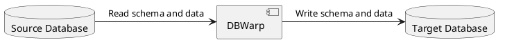
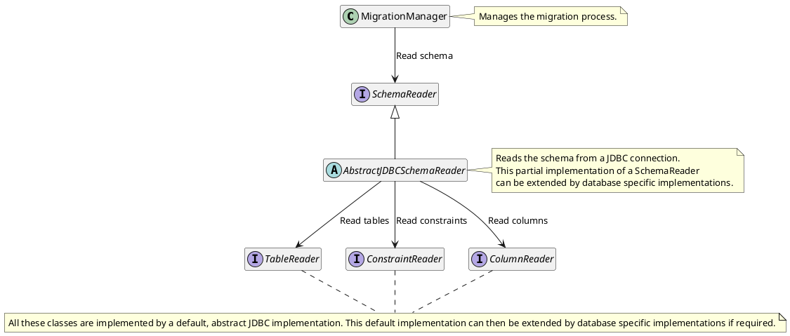
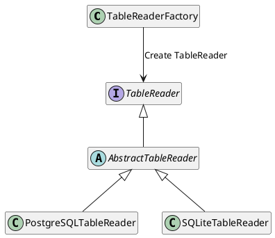
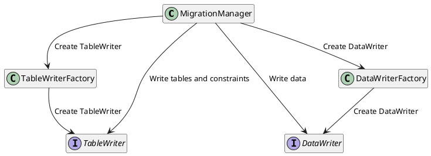
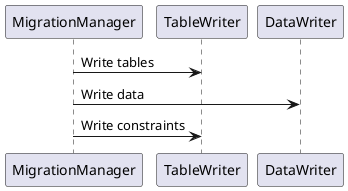
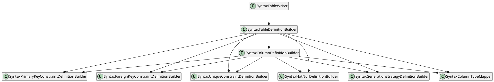

# Architecture Documentation

## Technical Context

DBWarp is an application used to copy the database schema
and its records from a source database to a target database.

This is accomplished while trying to be as database agnostic as possible.
This means that even if the source and target databases are of a different type,
DBWarp will still be able to copy the schema and data while
making educated assumptions on the data types and constraints.

## Architecture

The architecture of DBWarp is conceptualized as a pipeline
where the source database is read, the data is transformed
and then written to the target database.

This happens in multiple steps:

1. Read the schema (Tables, Constraints) of the source database.
2. Write the table definitions to the target database.
3. Transfer the data from the source database to the target database.
4. Write the constraints to the target database.

All of these steps are implemented in a way that aims to make them
as extensible as possible.
The last three steps are using an XML-based configuration called "Syntax"
which contains templates that are rendered into SQL statements.
Therefore, these steps are highly configurable by developers and users.

## Reading the source schema

For each step in reading the source schema, there is a separate class:
SchemaReader, for coordinating the reading process,
TableReader, for reading the tables,
ColumnReader, for reading the columns,
and ConstraintReader, for reading the constraints.

**General implementation:**

**Class construction:**

All Reader-classes (SchemaReader, TableReader, ColumnReader, ConstraintReader) are constructed
using the Factory pattern as shown below on the example of the TableReader.

#### Writing the schema to the target database

Writing the schema to the target database is a much more intricate process than reading the schema.
This is because the schema has to be written in a specific order to avoid conflicts.
For example, in most database systems a table cannot be created if a foreign key constraint
references a table that does not exist yet.

However, a notable exception to this rule is SQLite where foreign key constraints cannot be added
after the table has been created.
Therefore, the constraints have to be written in the table definition and remain disabled during the
write process.

**General implementation:**

**Sequence diagram:**

**TableWriter architecture:**

For each table, the TableWriter will write the table definition.
This is done by using a template that is rendered into a SQL statement.

For each independent part of the table definition (columns, constraints, etc.) a separate class is
provided.
The output of these classes is then combined by the TableDefinitionBuilder.

In this first step of writing the schema to the target database, normally only the table definitions
would be written.
However, there are database systems that do not allow for adding constraints after the table has
been created.
Therefore, depending on the configuration specified in the Syntax, the constraints can be written in
this step as well.

There are multiple possible places for the constraints to be written:

- In the table definition body, e.g. after the columns
- In the column definitions

To provide all these different approaches,
both the TableDefinitionBuilder and the ColumnDefinitionBuilder will
have to be able to handle constraints.

The following class diagram shows an overview of the classes that are involved in writing the schema
to the target database.

#### Writing the data to the target database

Compared to writing the schema, writing the data is a much simpler process.
For each table, the records are first read from the source database.
After that the according insert statements are collected and written to the target database in a
single batch.

## Risks and architecture drawbacks

### Database Agnostic Approach

The first step of reading the schema is done by using the JDBC API.
This allows DBWarp to connect to any database that has a JDBC driver.
However, more complex database features will require the default implementations
to be adapted.
While these adaptations are not extensive,
this is the biggest drawback in DBWarp's database agnostic approach.

### Data Transfer

The data transfer is done in a single batch.
This means that all records are read from the source database and then written to the target
database.
This can lead to performance issues if the amount of data is too large to be held in memory.
In the future, this process could be optimized by using a streaming approach.

### Code duplication

Especially with the table writing process, there is a lot of code duplication.
This code duplication is required because constraints have to be written at many different places in
the code.
In the future, this could be optimized by outsourcing the template rendering to a single class.